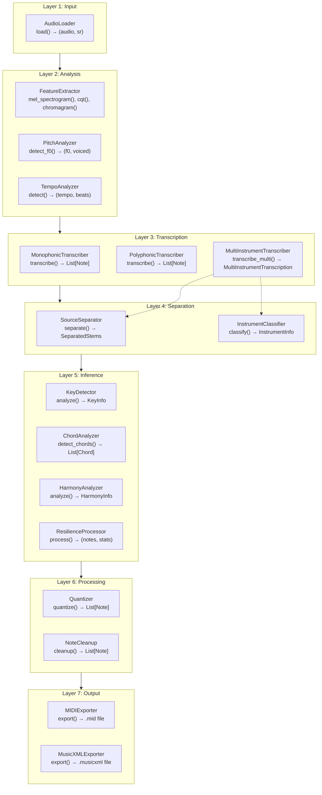

# Song Analyzer Architecture

This document describes the architecture of the Song Analyzer automatic music transcription system.

## System Overview

Song Analyzer uses a seven-layer pipeline architecture to convert audio recordings into musical notation:



## Layer Details

### Layer 1: Input (`src/input/`)

Handles audio file loading and preprocessing.

| Component | File | Purpose |
|-----------|------|---------|
| `AudioLoader` | `loader.py` | Load audio files in various formats |

**Supported Formats:** WAV, MP3, FLAC, OGG, M4A, MP4

**Key Methods:**
- `load(file_path) → (np.ndarray, int)` - Load audio, return (samples, sample_rate)
- `get_duration(audio, sr) → float` - Get duration in seconds
- `_normalize(audio) → np.ndarray` - Normalize audio to [-1, 1]

### Layer 2: Analysis (`src/analysis/`)

Extracts audio features for downstream processing.

| Component | File | Purpose |
|-----------|------|---------|
| `FeatureExtractor` | `features.py` | Compute spectral features |
| `PitchAnalyzer` | `pitch.py` | F0 detection using pYIN |
| `TempoAnalyzer` | `tempo.py` | Beat and tempo detection |

**Key Features:**
- **Mel Spectrogram:** 128 mel bands, used for general audio analysis
- **CQT (Constant-Q Transform):** 84 bins (7 octaves), used for polyphonic transcription
- **Chromagram:** 12-bin pitch class representation for harmony analysis
- **pYIN:** Probabilistic YIN algorithm for monophonic pitch tracking

### Layer 3: Transcription (`src/transcription/`)

Converts audio features into discrete note events.

| Component | File | Purpose |
|-----------|------|---------|
| `Transcriber` | `base.py` | Abstract base class |
| `MonophonicTranscriber` | `monophonic.py` | Single melody transcription |
| `PolyphonicTranscriber` | `polyphonic.py` | Multi-note/chord transcription |
| `MultiInstrumentTranscriber` | `multi_instrument.py` | Per-stem transcription |

**Monophonic Pipeline:**
1. pYIN pitch detection → F0 contour
2. Voiced/unvoiced segmentation
3. Note segmentation based on pitch stability
4. Optional CREPE for improved accuracy (when available)

**Polyphonic Pipeline:**
1. CQT computation
2. Multi-pitch estimation via peak picking
3. Neural model (piano_transcription_inference) when available
4. Fallback: CQT-based onset/offset detection

### Layer 4: Separation (`src/separation/`)

Source separation for multi-instrument audio.

| Component | File | Purpose |
|-----------|------|---------|
| `SourceSeparator` | `demucs_separator.py` | Demucs-based separation |
| `InstrumentClassifier` | `instrument_classifier.py` | Classify separated stems |

**Demucs Models:**
- `htdemucs` (default): 4 stems - drums, bass, vocals, other
- `htdemucs_6s`: 6 stems - drums, bass, vocals, guitar, piano, other

**Fallback:** Bandpass filtering when Demucs is unavailable

### Layer 5: Inference (`src/inference/`)

Musical analysis and interpretation.

| Component | File | Purpose |
|-----------|------|---------|
| `KeyDetector` | `key.py` | Key and mode detection |
| `ChordAnalyzer` | `chords.py` | Chord detection and progression |
| `HarmonyAnalyzer` | `harmony.py` | Integrated harmony analysis |
| `ResilienceProcessor` | `resilience.py` | Note filtering and correction |

**Key Detection:**
- Krumhansl-Schmuckler algorithm with Krumhansl/Temperley profiles
- Pitch class histogram correlation
- Relative key detection (major/minor)

**Chord Detection:**
- Template matching with common chord voicings
- Key-context aware detection
- Roman numeral analysis
- Cadence identification

### Layer 6: Processing (`src/processing/`)

Post-processing and note refinement.

| Component | File | Purpose |
|-----------|------|---------|
| `Quantizer` | `quantize.py` | Snap notes to rhythmic grid |
| `NoteCleanup` | `cleanup.py` | Remove artifacts and fix overlaps |

**Quantizer:**
- Grid-based quantization (default: 16th notes)
- Tempo-aware timing adjustment
- Configurable quantization strength

**Cleanup:**
- Ghost note removal (velocity < threshold)
- Short note merging
- Gap filling
- Overlap resolution

### Layer 7: Output (`src/output/`)

Export to standard formats.

| Component | File | Purpose |
|-----------|------|---------|
| `MIDIExporter` | `midi.py` | Export to MIDI format |
| `MusicXMLExporter` | `musicxml.py` | Export to MusicXML |

## Data Contracts

### Core Data Types

```python
@dataclass
class Note:
    pitch: int          # MIDI pitch (0-127)
    onset: float        # Start time in seconds
    offset: float       # End time in seconds
    velocity: int       # MIDI velocity (0-127), default: 64
    instrument: str     # Optional instrument name
```

### Inter-Layer Data Flow

| From → To | Data Type | Description |
|-----------|-----------|-------------|
| Input → Analysis | `(np.ndarray, int)` | Audio samples and sample rate |
| Analysis → Transcription | `np.ndarray` | Feature arrays (mel, cqt, chromagram) |
| Transcription → * | `List[Note]` | Detected note events |
| Separation → Transcription | `SeparatedStems` | Dict mapping StemType to audio |
| Inference → * | `KeyInfo`, `Chord`, `HarmonyInfo` | Musical analysis results |
| Processing → Output | `List[Note]` | Cleaned and quantized notes |

### Key Data Classes

```python
@dataclass
class KeyInfo:
    root: str                    # e.g., "C", "F#"
    mode: str                    # "major" or "minor"
    confidence: float            # 0.0 to 1.0
    ambiguity_score: float       # Higher = more ambiguous
    relative_key: str            # Relative major/minor
    alternatives: List[tuple]    # Other possible keys
    pitch_class_distribution: np.ndarray  # 12-element histogram

@dataclass
class Chord:
    root: str                    # e.g., "C", "G"
    quality: str                 # "major", "minor", "dominant7", etc.
    onset: float                 # Start time
    offset: float                # End time
    notes: List[int]             # MIDI pitches in chord
    bass: Optional[str]          # Bass note (for inversions)
    confidence: float            # Detection confidence

@dataclass
class StemAudio:
    stem_type: StemType          # DRUMS, BASS, VOCALS, etc.
    audio: np.ndarray            # Audio samples
    sample_rate: int             # Sample rate
```

## File Structure

```
src/
├── __init__.py
├── cli.py                      # Command-line interface
├── core/
│   ├── __init__.py
│   ├── constants.py            # SAMPLE_RATE, PITCH_NAMES, etc.
│   └── note.py                 # Note dataclass
├── input/
│   ├── __init__.py
│   └── loader.py               # AudioLoader
├── analysis/
│   ├── __init__.py
│   ├── features.py             # FeatureExtractor
│   ├── pitch.py                # PitchAnalyzer
│   └── tempo.py                # TempoAnalyzer
├── transcription/
│   ├── __init__.py
│   ├── base.py                 # Transcriber ABC
│   ├── monophonic.py           # MonophonicTranscriber
│   ├── polyphonic.py           # PolyphonicTranscriber
│   └── multi_instrument.py     # MultiInstrumentTranscriber
├── separation/
│   ├── __init__.py
│   ├── demucs_separator.py     # SourceSeparator
│   └── instrument_classifier.py # InstrumentClassifier
├── inference/
│   ├── __init__.py
│   ├── key.py                  # KeyDetector
│   ├── chords.py               # ChordAnalyzer
│   ├── harmony.py              # HarmonyAnalyzer
│   ├── melody.py               # MelodyAnalyzer
│   ├── structure.py            # StructureAnalyzer
│   └── resilience.py           # ResilienceProcessor
├── processing/
│   ├── __init__.py
│   ├── quantize.py             # Quantizer
│   └── cleanup.py              # NoteCleanup
└── output/
    ├── __init__.py
    ├── midi.py                 # MIDIExporter
    └── musicxml.py             # MusicXMLExporter
```

## Performance Considerations

### Computational Hotspots

| Operation | Typical Time | Notes |
|-----------|--------------|-------|
| Demucs separation | 30-60s / 3min song | GPU: 5-10s |
| Neural transcription | 10-30s / 3min song | Depends on model |
| CQT computation | 1-5s / 3min song | Multiple calls add up |
| Resampling | 0.5-2s | Happens at multiple stages |

### Optimization Opportunities

1. **Caching:** Demucs results could be cached to disk
2. **GPU Usage:** Both Demucs and neural transcription benefit from GPU
3. **Lazy Loading:** Models are loaded on first use, not at import
4. **Chunk Processing:** Long files can be processed in chunks

### Memory Usage

- **Demucs:** ~2-4GB GPU memory, ~8GB CPU memory
- **CQT:** Scales with audio duration (~500MB for 3min @ 22050Hz)
- **Note storage:** Minimal (~100 bytes per note)

## CLI Pipeline Flows

### Transcribe Command
```
load audio → detect tempo → transcribe → quantize → cleanup → export MIDI
```

### Analyze Command
```
load audio → transcribe → clean notes → detect key → detect chords → analyze harmony
```

### Separate Command
```
load audio (stereo) → Demucs separation → classify stems → transcribe each → export MIDIs
```

## Extending the System

### Adding a New Transcriber

1. Create class inheriting from `Transcriber` in `src/transcription/`
2. Implement `transcribe(audio, sr) → List[Note]`
3. Export from `__init__.py`
4. Add CLI flag if needed

### Adding a New Output Format

1. Create exporter class in `src/output/`
2. Implement `export(notes, path)` method
3. Handle tempo, time signature, key signature as needed
4. Add CLI command or option

### Adding New Audio Features

1. Add method to `FeatureExtractor` in `src/analysis/features.py`
2. Consider caching if expensive to compute
3. Use in transcription/inference layers as needed
